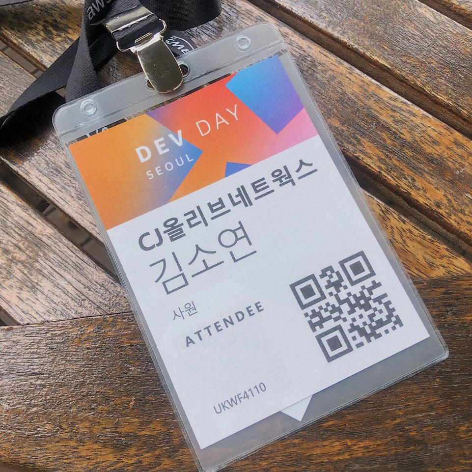
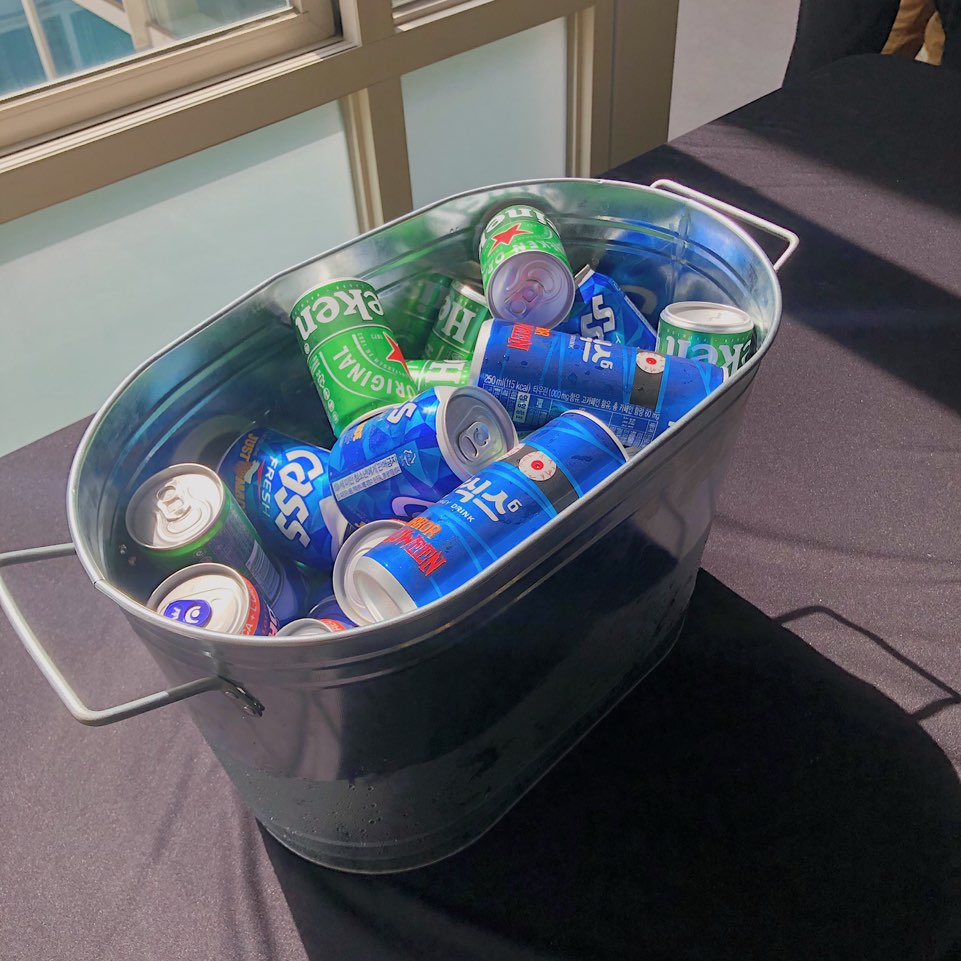

[2019 AWS Dev Day](https://aws.amazon.com/ko/events/devday/seoul/)에 참가했다. 참가한 주 목적은 사내에 SageMaker를 도입하고자 정보를 얻기 위함이다. 😏

 

## 행사 일정

오전에는 전반적인 aws 서비스 소개를 듣고, 오후에는 본인이 원하는 세션을 찾아 듣는 방식.

| 시간          | 내용                   |
| ------------- | ---------------------- |
| 09:00 - 10:00 | 등록 및 전시 부스 관람 |
| 10:00 - 11:30 | 기조 연설              |
| 11:30 - 12:45 | 점심 시간              |
| 12:45 - 17:30 | 강연 및 실습 워크샵    |

 

오후 시간에는 총 3세션의 강연(인공지능/기계 학습, 앱 현대화, 이머징 테크)과 4세션의 실습 워크샵(GluonCV, IoT+SageMaker, EKS, Amplify+AI)이 준비되어있었고, 나는 **인공지능/기계 학습** 세션을 청강했다.

사실 **Amplify와 AI 서비스를 활용한 서버리스 기반 소셜 안드로이드 앱 만들기** 실습도 해보고싶었던터라 조금 아쉬움이 남았다. 😢

 

### 인공지능/기계 학습 강연 일정

| 시간           | 내용                                                         |
| -------------- | ------------------------------------------------------------ |
| 12:45 - 13:45  | **개발자를 위한 수백만 사용자 대상 기계 학습 서비스 확장 하기** *윤석찬 수석테크에반젤리스트, AWS 문효준 책임 연구원, LG전자*  기계 학습은 이제 개발자에게 필수 기술셋이 되었습니다. 이미지/비디오 인식, 음성 인식 및 합성, 비지니스 예측, 사용자 추천 등 다양한 스마트 애플리케이션 개발 및 배포를 위해 기계 학습 기술을 배우고 이를 적용해야 합니다. 본 세션에서는 AWS의 다양한 서비스를 활용하여 개발자들이 기계 학습을 처음 접하는 시점부터 혼자서 공부하는 방법부터 팀에서 초기 도입시, 그리고 정식 프로덕션 환경에서 수백만 사용자를 위한 서비스를 향해 가는 과정을 알려드림으로서 머신 러닝 엔지니어가 될 수 있는 방법을 알아봅니다. |
| 14:00 - 15:00  | **기계 학습 싸고 빠르게 하는 방법 - Amazon SageMaker 편** *김필호 솔루션즈 아키텍트, AWS*  기계 학습을 기반한 서비스를 개발하기 위해서는, 데이터 준비, 모델 훈련과 배포의 다양한 과정을 반복적으로 진행해야 합니다. AWS에서는 각 과정별로 사용자가 각자 워크로드에 맞춘 가장 비용 효율적인 ML 프레임워크인 Amazon SageMaker 관리형 서비스를 제공하고 있습니다. 본 세션에서는 SageMaker를 활용하는 방법과 함께 어떻게 하면 모델 생성, 학습 및 배포를 위한 자원을 가장 효율적이고 경제적으로 사용할 수 있는 방법을 소개합니다. |
| 15:15 - 16:15  | **AWS 기반 기계 학습 자동화 및 최적화를 위한 실전 기법** *남궁영환 AI/ML 솔루션즈 아키텍트, AWS*  기계 학습 모델을 서비스로 제공하려면, 지속적인 학습 및 배포 과정이 필요합니다. 모델 훈련시 최적화 과정, 배포된 모델이 추론을 통해 서비스 되기 위한 성능 개선도 필수 요소입니다. 본 세션에서는 AWS를 활용한 대규모 리소스를 이용한 효율적인 모델 학습 시 유용한 내용들을 소개합니다. 대규모 리소스를 이용할 경우 인프라 선택, 모델 학습 환경 선택 및 구성, 확장성 등이 함께 고려되어야 합니다. 이와 관련한 AWS 서비스들의 특징과 어떤 결과를 보여주는지도 함께 알아봅니다. |
| 16:30  - 17:30 | **Intel on AWS, AI/ML Service 성능 향상을 위한 협력 모델** *서지혜 솔루션즈 아키텍트, AWS 김종학 과장, Intel*  클라우드는 데이터 수집, 저장, 맞춤형 AI/ML 모델 생성 등 대규모 AI워크로드 운영을 비용 효율적이며 쉽게 만들어 줄 수 있습니다. 이 세션에서는 AI 워크로드를 간단하고 빠르게 처리하기 위해 AWS와 Intel이 어떻게 협력하고 있는지에 관해 설명합니다. 첫 번째로 AWS C5 인스턴스에 적용된 고성능 Intel Xeon® Scalable processors 기술에 대해 설명합니다. 그리고 강화 학습으로 생성된 모델을 가지고 자율 주행하는 1/18 스케일의 자동차DeepRacer 에 적용된 Intel의 강화 학습 라이브러리 및 Inference engine (Openvino)에 대해서도 알아봅니다. 이 밖에도 AWS AI/ML Marketplace에 제공 되고 있는 Intel의 AWS AI/ML library 및 모델에 대해 알아봅니다. |

 

## Register

친절하신 aws 직원분들이 등록을 도와준다. 회사명이 이렇게 대문짝하게 찍히는줄 모르고 적어냈는데 bold 적용돼서 출력되는 덕분에, 나를 IT부문에서 왔다고 착각하시곤 말을 거시던 분들이 계셨다. 아니라고하기가 민망해서 대충 대화를 하긴 했는데 전 일개 OY 정보전략팀이라 아무것도 모릅니다..

 

 

## 기조 연설

### Kick off (Olivier Klein, AWS)

**Modern Application Design**: 애플리케이션 모듈화를 위해 현재 방식에서 아키텍쳐 패턴 변경, 운영 방식 변경, 배포 방식 등을 변경해야함. 이를 microservice라고 지칭한다. microservice끼리는 API를 통해 통신을 하며, 서비스의 구성은 code, sdk, data stores로 구성되어있다. data stores를 선택할 수 있다는것은 데이터베이스 전략을 세움으로서 나에게 가장 적합한 것을 선택할 수 있다는 것을 의미한다.

**Serverless**: microservice를 지향하기 위해서는 serverless를 추구해야한다. AWS Lanbda, AWS Fargate, 그리고 새로운 AWS Lambda Layers를 통해서 

**Auto rollout**: 배포 과정을 자동화해야한다.

 

### AWS를 사용한 클라우드 마이그레이션 경험 공유 (정성권 수석, 삼성전자)

**SAMSUNG Account**

Cloud native를 제공하기 위해서는 IDC에서 벗어나 안정적인 클라우드로 옮겨야한다는 생각을 하게 되었음. 그러나 삼성 전체의 인증을 담당하기 때문에 안정적인 **무중단** 마이그레션이 필요했음

1. 클라우드 마이그레이션
   - **인프라스트럭쳐 엔지니어의 역할**: 마이그레이션 아키텍처 - API GW 기반 Strangler 패턴 적용, 클라우드 인프라스트럭처 기반 코드 작성, Immutable 인프라스트럭처, CI/CD 파이프라인 구축: Python
   - **데이터베이스 관리자의 역할**: 데이터 마이그레이션 계획, 데이터 로딩 및 CDC 동기화, 스키마 및 쿼리 변환, 데이터베이스 관리

2. 마이크로서비스로 리팩토링
3. 컨테이너 기반 클라우드 네이티브

**클라우드 이전으로 인한 이점**: 라이선스 비용 절감, 관리형 서비스 활용, 오픈소스 활용 경험 축적, 다양한 서비스 실험 가능

 

### AWS application 소개 (Olivier Klein, AWS)

#### DEMO

- **사진을 촬영한 3D 렌더링 어플리케이션**: 여러 각도에서 사진을 찍고 3D 렌더링을 하여 스마트폰으로 볼 수 있는 어플리케이션

  1. 약 80장 정도의 사진을 촬영하고 3D 렌더링을 통해 와이어프레임 생성, 텍스쳐 적용을 할 수 있음
  2. AWS의 sumerion을 통해 HTML로 작성한 앱을 사용자에게 배포

- **Auto-drive Robot**: 벽을 인지하여 미로를 찾는 자율주행 로봇

  1. 일차적으로 사람의 조종에 의해 로봇이 움직이면서 자기가 있는 공간을 파악하여 벽이 어디있는지, 안전하게 갈 수 있는 길이 어디인지 파악을 함.

  2. Navigation goal을 주어 주행을 시키면 서서히 셀프 주행을 배움. 처음에는 센서 정보에 의존하여 조심스럽게 움직임. (이때 몇 초 정도의 inference 때문에 순간 프로그램이 죽은 것처럼 보여서 Olivier가 당황했었습니다. :joy:) 

- **Unicon with corn-dog**: 핫도그를 찾아다니는 유니콘 시뮬레이션

  1. SageMaker RL + Sumerian을 활용하여 구현
  2. 유니콘에게 핫도그를 먹으라고 특별히 명령한 것이 아님. 처음에는 돌기만 함. 그럴 때는 마이너스, 마이너스... 핫도그에 가까이 갈 수록 플러스, 플러스를 리워드를 하면, 핫도그에 가까이 갈 수록 보상을 받는다는 것을 알게 됨. 결국 유니콘은 최종적으로 핫도그를 찾아 움직이게 됨.

#### Applications with mobile app roll-on

- Amazon 3D
- Amazon Sumerian

#### Applications with IoT

- AWS Robot matics
- AWS AppSync: Network connection-less 상황에서 서비스가 끊김 없이 동작할 수 있도록 지원함. 
- AWS Greengrass: Edge로 로직을 구성할 수 있도록 지원함.

#### Data 

- Glacier Database: 클라우드 상 가장 저렴한 DB Storage
- AWS S3

#### AI and Machine Learning

AI Services - ML Services - ML Frameworks + Infrastructure

- AWS SageMaker

  Computer visioning: 일반 웹카메라로도 모션 인식, hit cam 등이 가능함

  - Amazon Eleastic inference: GPU를 필요할 때 증폭하고 감소할 수 있음. 런칭 이후 전체 비용의 75%까지 절감했다는 후기를 많이 들음

- AWS Inferentia: 추론의 비용을 10배 줄일 수 있는 서비스를 내년에 런칭할 예정임

- Amazon SageMaker RL: 머신러닝을 하고 싶은데 데이터가 없을 때를 위한 강화학습 모델. State - Action - Reward 과정을 거쳐서 쉽게 데이터를 만들 수 있음 

  

## 개발자를 위한 수백만 사용자 대상 기계 학습 서비스 확장 하기

*기계 학습은 이제 개발자에게 필수 기술셋이 되었습니다. 이미지/비디오 인식, 음성 인식 및 합성, 비지니스 예측, 사용자 추천 등 다양한 스마트 애플리케이션 개발 및 배포를 위해 기계 학습 기술을 배우고 이를 적용해야 합니다. 본 세션에서는 AWS의 다양한 서비스를 활용하여 개발자들이 기계 학습을 처음 접하는 시점부터 혼자서 공부하는 방법부터 팀에서 초기 도입시, 그리고 정식 프로덕션 환경에서 수백만 사용자를 위한 서비스를 향해 가는 과정을 알려드림으로서 머신 러닝 엔지니어가 될 수 있는 방법을 알아봅니다.*

 

### 환경구성 (윤석찬 수석테크에반젤리스트, AWS)

**EC2 GPU Instances**

- G4 instance: OpenGL, DirectX, CUDA, OpenCL 등 그래픽 동영상 최적화
- P3 instance: Tensorflow 등
- On-demand GPU

**EC2 Spot 인스턴스 구매 옵션**

- 최대 75% 할인된 가격에 모델 훈련 시에만 사용 가능

- 스팟 가격의 흐름을 통해 예측 가능
- On-Demend 대비 70% 할인 된 가격으로 사용 가능

 

### 컨테이너 기반의 기계학습 운영 사례 (문효준 책임 연구원, LG전자)

**컨테이너 선택**

- Docker: 독립적인 환경 제공함으로 언어의 다양성 보장
- 클라우드에 올리기 민감한 사내 데이터는 SQS를 통해 Container가 주도적으로 Next job을 하도록 처리

**효과적인 운영**

- **Kubernetes**: 어디 서버에서 어떻게 장애가 났는지 관리할 필요없이, kubernetes에 명령하면 알아서 사용 가능한 자원에 할당해줌. Amazon EKS 부분이 블랙박스가 되었기 때문에 개발의 효율이 올라갔음
- **AWS 기반의 K8S**: Amazon EKS, Auto Scaling - CLuster Auto Scaler, Helm Chart, Argo Workflow

**In Closing**

- ML 공부할 필요 없다면 제일 좋습니다 > AI API 서비스 활용
- 시작한다면, SageMaker로 시작하세요 > 완전 관리형 서비스
- 모델 훈련 및 배포 비용을 꼭 아끼세요 > 딥러닝 AMIs/Container
- 반복적인 개발 비용을 꼭 염두해 두세요 > 

  

## 기계학습 싸고 빠르게 하는 방법: SageMaker

*기계 학습을 기반한 서비스를 개발하기 위해서는, 데이터 준비, 모델 훈련과 배포의 다양한 과정을 반복적으로 진행해야 합니다. AWS에서는 각 과정별로 사용자가 각자 워크로드에 맞춘 가장 비용 효율적인 ML 프레임워크인 Amazon SageMaker 관리형 서비스를 제공하고 있습니다. 본 세션에서는 SageMaker를 활용하는 방법과 함께 어떻게 하면 모델 생성, 학습 및 배포를 위한 자원을 가장 효율적이고 경제적으로 사용할 수 있는 방법을 소개합니다.*

 

### Amazon SageMaker 가격 모델

- https://aws.amazon.com/sagemaker/pricing
- **사용한 만큼만 비용을 지불**: 최소 요금 및 선수금 없이 초 단위로 부과
- Amazon SageMaker 내 요금: ML 인스턴스 / ML 스토리지 / 인스턴스에서의 데이터 처리 비용

**Amazon SageMaker On-Demand ML Instances**

- 기계 학습 컴퓨팅 파워에 대해 초 단위로(최소 1분) 요금을 지불할 수 있으며, 장기 약정은 없음.
- 모델 훈련 및 배치 변환 작업의 경우, 작업이 완료된 후 인스턴스를 자동으로 종료함. 작업을 실행하는 시간에 대해서만 요금을 청구함.
- 모델 구축용 서버: t instance 라인으로도 가능함
- 학습 구축용 서버: 인스턴스 생성 후 필요한 만큼 사용이 끝나면 자동으로 소멸되므로 버퍼를 잡아서 사용할 수 있음

 

### 머신러닝 가격 최적화 기법

모든 머신러닝 프로젝트는 대량의 데이터의 정제와 레이블링이 필요함. 그 과정에서 **EC2 기반이나 EMR에 자체 ETL 툴**을 활용하여 고려하면 비용을 절감할 수 있음: Amazon Athena, AWS Glue, AWS Lake Formation

**SageMaker Ground Truth**

- 레이블링 작업환경: 정의된 환경 및 맞춤형으로도 지원 - Bounding boxes, Image classification, Semantic segmentation, Text classification, Custom

- 동작방법: Raw Data - Human Annotations - Active Learning Model - Automatic Annotations - Traning Data

- **확률 기반 레이블 의견 차이 합병 방법** 로직을 사용하여 정확도 높은 알고리즘을 채택할 수 있음

- **자동 모델 튜닝**을 통한 모든 Hyper 알고리즘을 지원함

**Amazon Eleastic Inference**

딥러닝 추론 비용의 75%까지 절감

- 낮은 추론 비용
- 수요 변화에 대응
- 1~32 TFLOPS

**Neo**

- ML을 위한 컴파일러이자 실행환경: Parse Model > Optimize Graph > Optimize Tensors > Generate Code
- 오픈소스이며, 또 많은 오픈소스와 결합되어 있음

 

### AWS Billing and Cost Management

**AWS Budgets**

- 사용량을 초과할 때 통보하는 기능
- 예약된 서비스의 사용률이나 담당률을 추적하는 기능

**AWS SageMaker 프리티어**

- 처음 2개월동안 매월 무료로 제공

  

## AWS 기반 기계 학습 자동화 및 최적화를 위한 실전 기법

*기계 학습 모델을 서비스로 제공하려면, 지속적인 학습 및 배포 과정이 필요합니다. 모델 훈련시 최적화 과정, 배포된 모델이 추론을 통해 서비스 되기 위한 성능 개선도 필수 요소입니다. 본 세션에서는 AWS를 활용한 대규모 리소스를 이용한 효율적인 모델 학습 시 유용한 내용들을 소개합니다. 대규모 리소스를 이용할 경우 인프라 선택, 모델 학습 환경 선택 및 구성, 확장성 등이 함께 고려되어야 합니다. 이와 관련한 AWS 서비스들의 특징과 어떤 결과를 보여주는지도 함께 알아봅니다.*

 

### P3 instance

- 대규모 병렬 처리가 필요한 워크로드에 적합: 기계학습 모델 트레이닝, HPC(High Perfomance Computing) 시뮬레이션, 3D 모델 렌더링, 비디오 인코딩

- 최대 8개의 NVIDIA Tesla V1000 GPU

#### P3dn.24xlarge instnace

- 클라우드에서 사용 가능한 가장 강력한 GPU 인스턴스
- 효율적인 대규모 ML 트레이닝 및 HPC 시뮬레이션 지원: 100Gbps 네트워크 대역폭을 이용한 멀티-노드 클러스터(32대 이상) 구성 가능
- 모델 트레이닝 및 시뮬레이션을 위한 데이터에 빠른 액세스 지원: Amazon S3, 네트워크 기반 파일 시스템, 로컬 인스턴스 스토리지
- 대규모 ML 모델 트레이닝 및 대규모 데이터 처리: 32GB GPU 메모리를 장착한 최신 NVIDIA V100 GPU
- 데이터 전처리 최적화에 적합: 96 vCPUs sing AWS Custom Skylake CPUs and 768GB of System Memory

### AWS FSx for Lustre

- 머신 러닝, HPC, 동영상 처리, 금융 모델링 등을 위한 고성능 파일 시스템
- S3와 기본적으로 연동됨
- Lustre는 1ms 미만의 지연 시간과 초당 수백 Gbps, 수백만 IOPS로 확장되는 처리량을 지원
- POSIX와 호환되므로, 특별히 추가 변경 없이 기존 Linux 기반 애플리케이션 사용 가능
- 사용한 리소스에 대해서만 비용 지불 (최소약정/선수금 없음)
- 클라이언트 모듈 커널 OS 사용 가능

### Horovod

- 분삭 딥러닝을 위한 오픈소스 프레임워크
- Stock TensorFlow, Keras, PyTorch 등과 연동하여 제작
- 쉽고 간단한 설치 `pip install horovod`
- 고급 알고리즘 사용 가능
- High-Performance 네트워크 (RDMA, GPUDirect) 지원
- ML 엔지니어와 인프라를 분리

  

## 마치며

내가 들은 세션은 전반적으로 aws 서비스 홍보로 시작해서 홍보로 끝나는 느낌뿐이어서.. 살짝 아쉬웠다. 우수사례 경험 공유가 중간중간 있긴 했지만, 그 외 세션들은 결국 홈페이지에 나와있는 내용을 좀 더 자세히 설명한 수준뿐이었기 때문에.. (실습 세션을 갈걸..!) 😢

그래도 매년 이렇게 좋은 행사 열어주는 Amazon에게 무궁한 감사를.. 🙇‍♀️ 끊임없이 제공되던 무한 맥주 최고 🧡

