AWS EC2 인스턴스에서 taining이 끝나고나면 90% 이상 치솟던 CPU 할당량이 0%로 수렴하게 되는데, 이 때 training이 끝났다는 알림 메시지를 받고 싶었다.

CloudWatch 실시간 모니터링을 하거나 경보를 설정해도 되지만, 모니터링에는 한계가 있고 경보도 사내보안 등등의 이유로 메일링 이슈가 있으며 SMS는 과금..^^... 때문에 여차저차한 이유로 AWS Labmda를 사용하여 Slack으로 알림을 받기로 했다.

[AWS doc](https://aws.amazon.com/ko/blogs/korea/slack-devops-with-aws-lambda-and-eb/)은 뭐랄까.. 불친절하고... [Slack doc](https://api.slack.com/messaging/webhooks)은 너무 오래돼서 ㅠㅠ 심지어 구글링해서 나오는 블로그 글들마저 다 오래되거나 원하는 내용들이 아니여서.. 이 김에 정리를 해보기로했다.

## 1. 사전준비

1. Slack workspace 및 channel 생성
2. (당연한 얘기지만) AWS 인스턴스

## 2. Slack에서 Webhooks URL 생성

1. [Slack api 페이지에서 app 생성](https://api.slack.com/apps?new_app=1) (이미 생성되어 있는 경우 건너뛰기)

   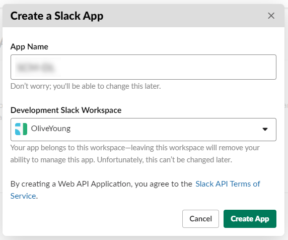

   <figcaption>사내 프로젝트라 AppName을 가리긴했지만 사실 엄청 대충 지었다^^!</figcaption>

2. 생성 후 리디렉션 되는 설정 페이지에서 [Incoming Webhooks](https://api.slack.com/apps/AS9191W0Z/incoming-webhooks?)를 클릭 (기존에 생성된 앱인 경우 [관리 대시보드](https://api.slack.com/apps)에서 앱을 클릭하여 접속하면 됨)

   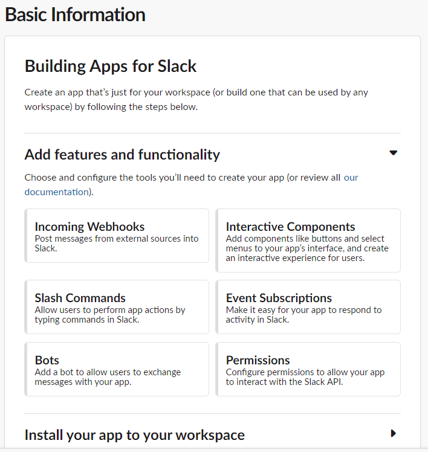

   <figcaption>Add features and functionality > Incoming Webhoos 클릭</figcaption>

3. Activate Incoming Webhooks 설정을 `on`으로 활성화하면, 아래처럼 가이드가 뜬다. 이 중에 최하단의 Add New Webook to Workspace 버튼을 클릭한다.

   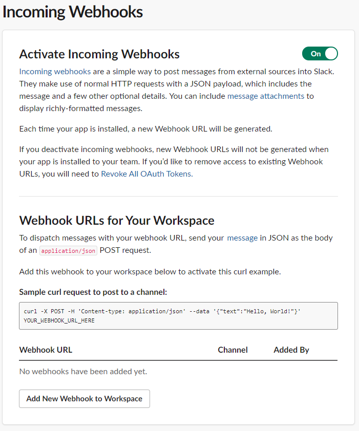

   <figcaption>토글을 활성화하고, Add New Webhook to Workspace 클릭</figcaption>

4. select 박스에서 채널까지 설정한 후 `Allow` 버튼을 클릭하여 완료 한다.

   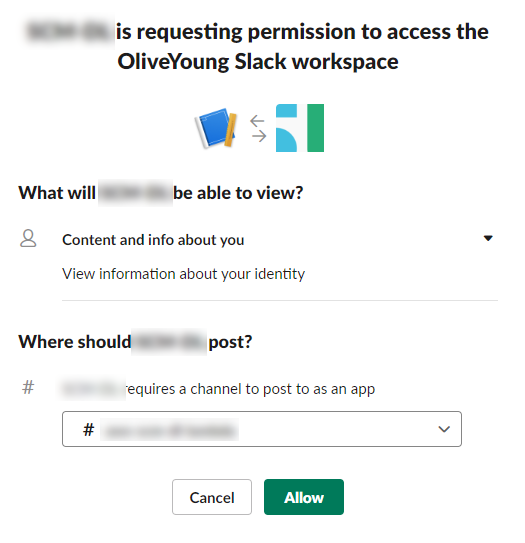

   <figcaption>모자이크한건 그냥 앱 이름이다</figcaption>

5. 그러면 이전 페이지로 돌아오며 짜잔하고 Webhook URL이 생성되어 목록에서 추가된 것이 보인다. 참고로 이 URL은 외부에 공개될 경우 보안상 이유가 있으므로, 보안 유의가 필요하다.

   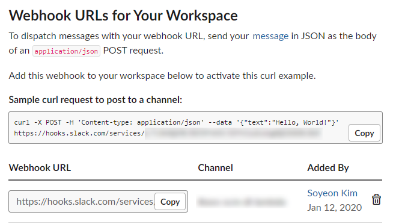

   <figcaption>Webhook URL이 생성되었다!</figcaption>

6. 마무리 - 테스트

   아래 URL로 테스트하면 해당 채널에 'Hello, World!'가 전송된 것을 확인할 수 있다. —고 한다. 사실 난 하지 않았다. 어쨌든 내 목표는 CloudWatch 연동이므로.. (이 정도는 당연히 되겠지하는 안일함^^..)

   ```sh
    curl -X POST -H 'Content-type: application/json' --data '{"text":"Hello, World!"}'
    <https://hooks.slack.com/services/>...
   ```

*Slack Webhoos을 통한 다른 사용 안내는 [Slack api document](https://api.slack.com/messaging/webhooks)에서 확인할 수 있다.*

## 3. AWS SNS 주제 생성

1. AWS console에서 SNS 콘솔에 접속하여 `주제 생성` 버튼을 클릭하여 주제를 생성한다. 이름만 입력하면 별다른 설정 없이 생성이 가능하다.

   다른 설정들은 이따가 아래에서 하는걸로..

   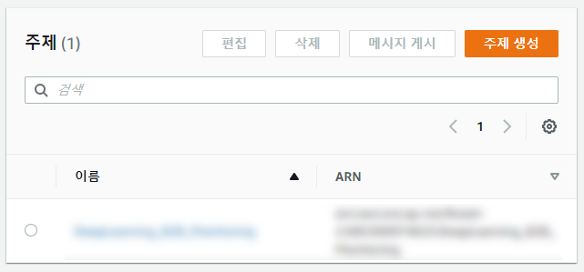

   <figcaption>후루룩 생성된 주제</figcaption>

## 4. AWS Lambda 함수 생성

1. AWS console에서 [Labmda](https://ap-northeast-2.console.aws.amazon.com/lambda) 콘솔에 접속하여 `함수 생성` 버튼을 클릭한다.

   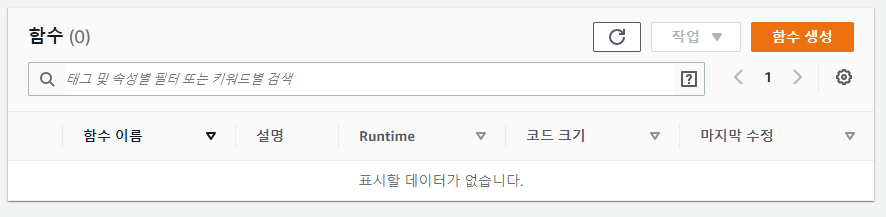

   <figcaption>주황색 버튼 클릭</figcaption>

2. 함수 생성 화면에서 `블루프린트 사용`을 클릭하고, 필터에 'slack'을 입력하면 해당되는 목록이 노출된다. 그 중 'cloudwatch-alarm-to-slack-python'을 선택하여 `구성` 버튼을 클릭한다.

   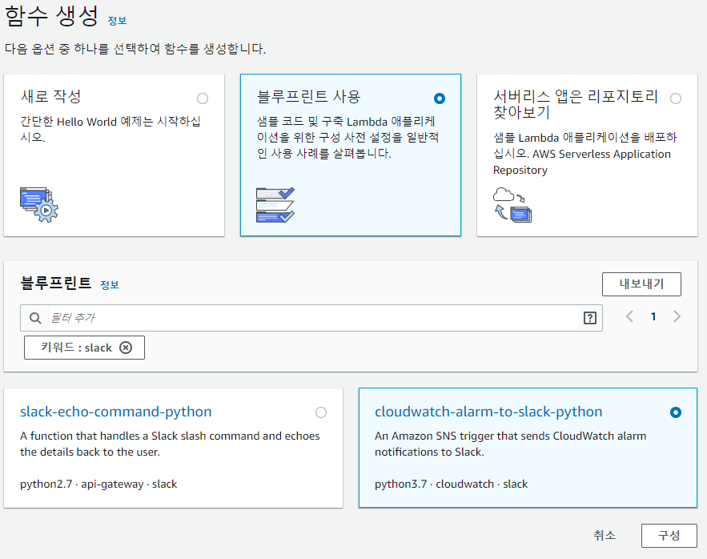

   <figcaption>블루프린트 사용 > cloudwatch-alarm-to-slack-python > 구성 클릭</figcaption>

3. 기본정보, SNS 트리거 등을 입력해준다.

   실행 역할은 `기존 Lambda 권한을 가진 새 역할 생성`으로 하고, SNS 트리거는 3번 step에서 생성한 주제를 선택해준다.

   사실 난 이떄 함수 이름 대충 test 라고 지었는데 나중에 수정이 안되니.. 처음부터.. 제대로 짓기를 권장한다..

   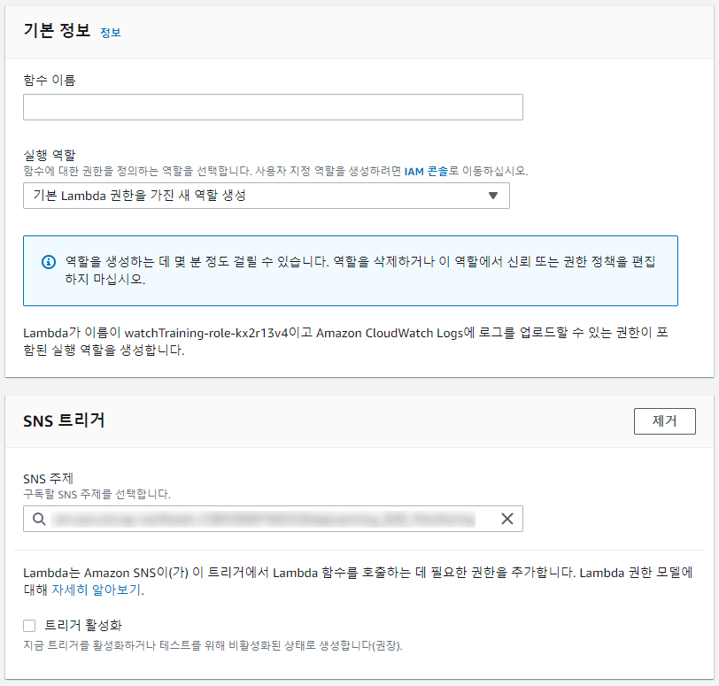

   <figcaption>3번에서 생성한 SNS 주제를 연결해주면 된다.</figcaption>

4. 환경변수는.. 뭐가 뭔지 모르겠으므로 대충 아무거나 입력해주고 생성한다. (일단 생성 먼저하고 수정하는걸로..)

   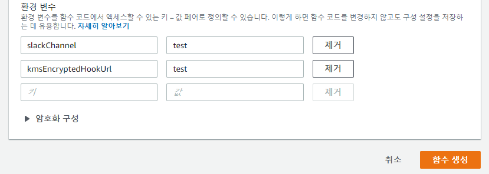

   <figcaption>대충 입력하고 하단 주황색 버튼 클릭</figcaption>

5. 생성 완료

   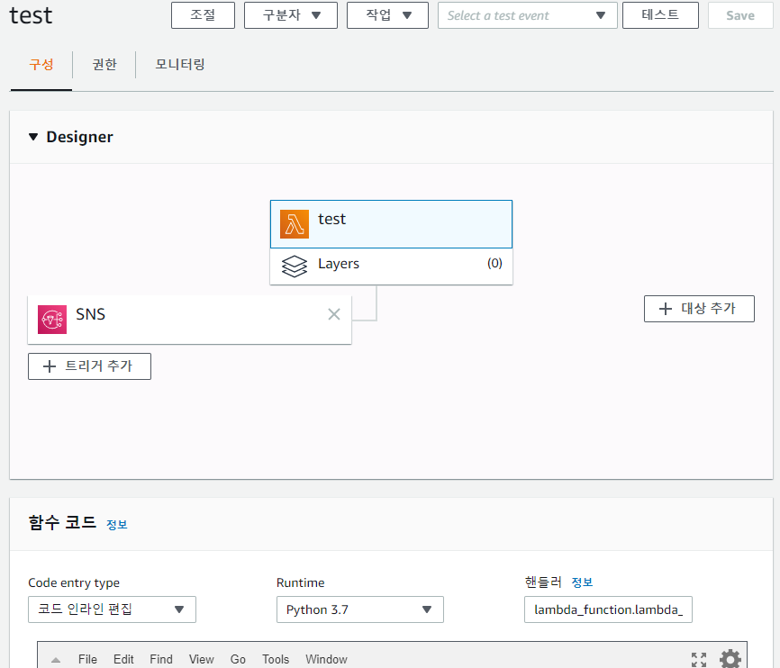

   <figcaption>주황색 아이콘의 lambda function이 생성되고, SNS 주제가 연결된 형태</figcaption>

## 5. AWS Lambda 설정

1. `함수 코드` 탭에서 코드를 수정한다.

   kms 암호화 적용.. 일단은 안할거다..

   ```diff
   import boto3
   import json
   import logging
   import os
   
   from base64 import b64decode
   from urllib.request import Request, urlopen
   from urllib.error import URLError, HTTPError
   
   # The base-64 encoded, encrypted key (CiphertextBlob) stored in the kmsEncryptedHookUrl environment variable
   - ENCRYPTED_HOOK_URL = os.environ['kmsEncryptedHookUrl']
   # The Slack channel to send a message to stored in the slackChannel environment variable
   SLACK_CHANNEL = os.environ['slackChannel']
   
   - HOOK_URL = "https://" + boto3.client('kms').decrypt(CiphertextBlob=b64decode(ENCRYPTED_HOOK_URL))['Plaintext'].decode('utf-8')
   + HOOK_URL = os.environ['hookUrl']
   
   logger = logging.getLogger()
   logger.setLevel(logging.INFO)
   
   def lambda_handler(event, context):
       logger.info("Event: " + str(event))
       message = json.loads(event['Records'][0]['Sns']['Message'])
       logger.info("Message: " + str(message))
   
       alarm_name = message['AlarmName']
       #old_state = message['OldStateValue']
       new_state = message['NewStateValue']
       reason = message['NewStateReason']
   
       slack_message = {
           'channel': SLACK_CHANNEL,
           'text': "%s state is now %s: %s" % (alarm_name, new_state, reason)
       }
   
       req = Request(HOOK_URL, json.dumps(slack_message).encode('utf-8'))
       try:
           response = urlopen(req)
           response.read()
           logger.info("Message posted to %s", slack_message['channel'])
       except HTTPError as e:
           logger.error("Request failed: %d %s", e.code, e.reason)
       except URLError as e:
           logger.error("Server connection failed: %s", e.reason)
   ```

2. `환경 변수` 탭에서 위 코드에 작성한 환경변수 값인 `hookUrl` 값과 `slackChannel` 값을 설정한다. 각각 Slack의 Webhook URL과 채널명을 입력하면 된다.

   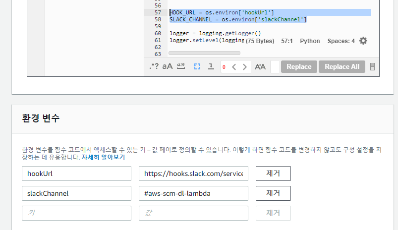

   <figcaption>코드에 맞게 hoolUrl과 slackChannel 변수 설정</figcaption>

   +) 사실 `hookUrl` 자체에 채널 정보가 포함되어있어서, `slackChannel` 변수자체를 코드에서 빼도 채널에 발송은 되는데, 이따가 마지막 단계에서 테스트해보면 `KeyError`가 나서... `lambda_function.py` 파일을 잘 찾아서 수정해주면 될것같긴한데, 그냥 뭐 크게 번거로운것도 아니니 채널명을 적어주기로했다.

   ```json
    {
      "errorMessage": "'channel'",
      "errorType": "KeyError",
      "stackTrace": [
        "  File \\"/var/task/lambda_function.py\\", line 81, in lambda_handler\\n    logger.info(\\"Message posted to %s\\", slack_message['channel'])\\n"
      ]
    }
   ```

## 6. CloudWatch 경보 설정

1. AWS console에서 [CloudWatch 콘솔](https://ap-northeast-2.console.aws.amazon.com/cloudwatch)에 접속하여 `경보 생성` 버튼을 눌러 경보를 생성한다.

   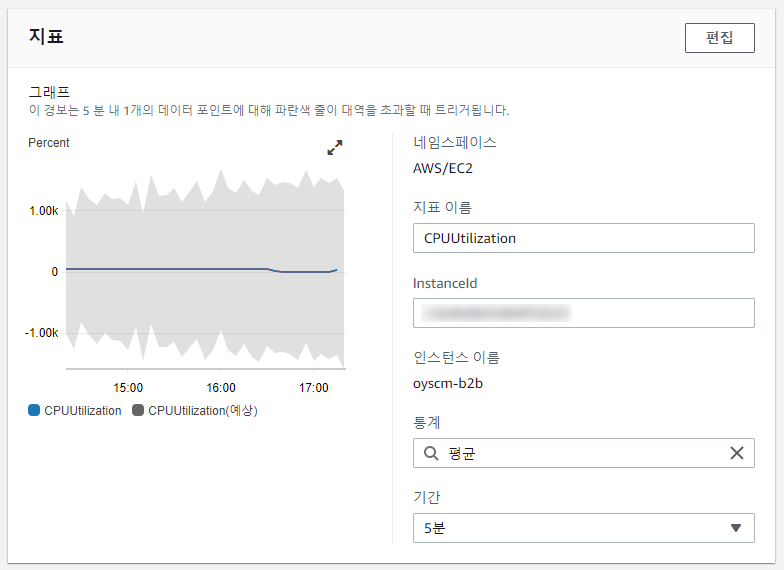

   <figcaption>대충 CPU 사용량을 5분 동안 체크하도록 했다.</figcaption>

   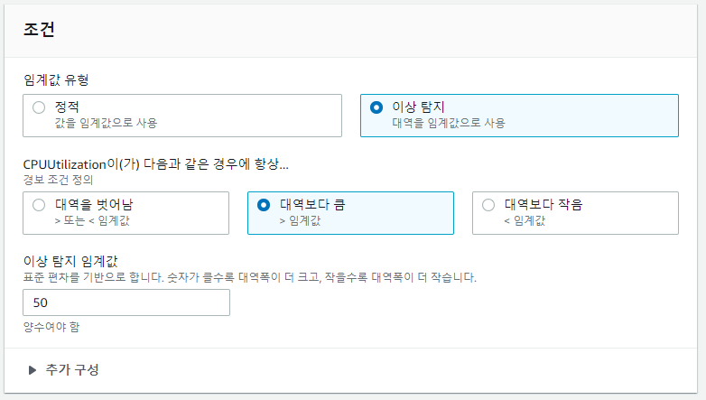

   <figcaption>조건도 일단은 50%를 넘어가는 경우를 체크하도록 설정했다.</figcaption>

2. `다음` 버튼을 눌러 작업 구성 탭에서 SNS 주제를 구성해준다.

   이 때 `SNS 콘솔에서 보기`를 클릭해준다.

   사실 난 3번 단계에서 SNS 주제 생성할 때 이것저것 설정을 건드리느라 이메일 엔드포인트가 이미 들어가있는데..  사실 어차피 slack 연동할거라서 할 필요도 없고, 필요하다면 나중에 해주면 된다.

   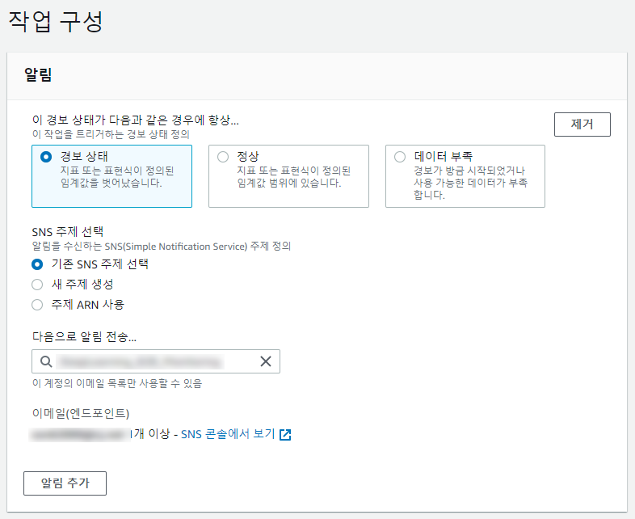

   <figcaption>기존 SNS 주제 선택 클릭하여 주제 연결</figcaption>

3. 프로토콜/엔드포인트를 아까 생성한 lambda로 지정해준다.

   

   <figcaption>생각해보니 지금 하고있는거 자체가 labmda에 sns를 연동하는건데, 왜 sns에 labmda 연동을 또 하지..?!</figcaption>

4. 그 다음 [Lambda console](https://ap-northeast-2.console.aws.amazon.com/lambda)로 다시 돌아와서 `SNS` 트리거를 클릭하면 하단에 연결된 정보와 함께 활성화된 것을 볼 수 있다.

   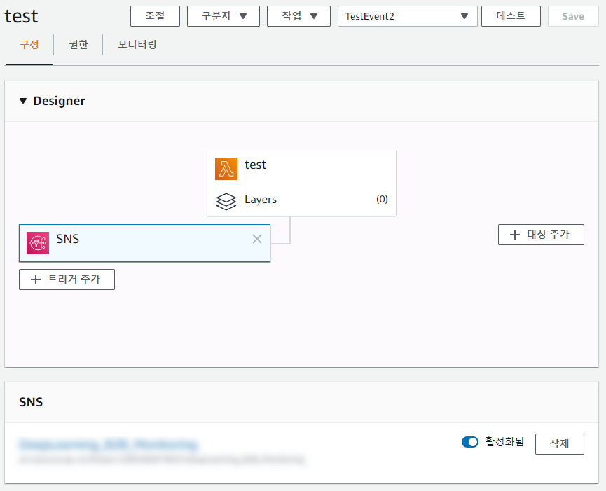

   <figcaption>하단에 SNS 항목이 추가되었다.</figcaption>

## 7. 테스트를 위한 Test-event 작성

1. 상단의 `테스트` 버튼 클릭

   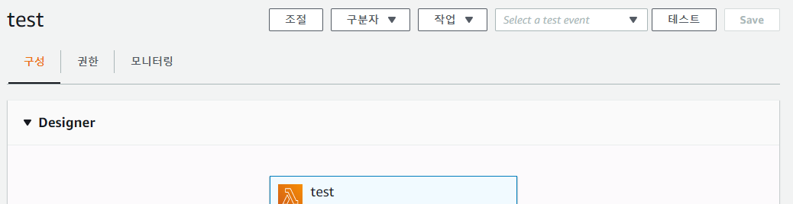

   <figcaption>테스트 버튼을 클릭하면 Configure test event 팝업이 뜬다.</figcaption>

2. 테스트 코드 작성

   이벤트 템플릿은 `Hello World`로 고정하고, 아래 테스트 코드를 입력창에 붙여넣은 뒤, `생성` 버튼을 눌러 생성을 완료한다.

   코드 원문은 [AWS doc](https://aws.amazon.com/ko/blogs/mobile/invoking-aws-lambda-functions-via-amazon-sns/)에서 찾았다.

   ```json
    {
      "Records": [
        {
          "EventSource": "aws:sns",
          "EventVersion": "1.0",
          "EventSubscriptionArn": "arn:aws:sns:eu-west-1:000000000000:cloudwatch-alarms:xxxxxxxx-xxxx-xxxx-xxxx-xxxxxxxxxxxx",
          "Sns": {
            "Type": "Notification",
            "MessageId": "xxxxxxxx-xxxx-xxxx-xxxx-xxxxxxxxxxxx",
            "TopicArn": "arn:aws:sns:eu-west-1:000000000000:cloudwatch-alarms",
            "Subject": "ALARM: \\"Example alarm name\\" in EU - Ireland",
            "Message": "{\\"AlarmName\\":\\"Example alarm name\\",\\"AlarmDescription\\":\\"Example alarm description.\\",\\"AWSAccountId\\":\\"000000000000\\",\\"NewStateValue\\":\\"ALARM\\",\\"NewStateReason\\":\\"Ping\\",\\"StateChangeTime\\":\\"2020-01-14T08:45:42.236+0000\\",\\"Region\\":\\"EU - Ireland\\",\\"OldStateValue\\":\\"OK\\",\\"Trigger\\":{\\"MetricName\\":\\"DeliveryErrors\\",\\"Namespace\\":\\"ExampleNamespace\\",\\"Statistic\\":\\"SUM\\",\\"Unit\\":null,\\"Dimensions\\":[],\\"Period\\":300,\\"EvaluationPeriods\\":1,\\"ComparisonOperator\\":\\"GreaterThanOrEqualToThreshold\\",\\"Threshold\\":1.0}}",
            "Timestamp": "2020-01-14T08:45:42.318Z",
            "SignatureVersion": "1",
            "Signature": "Cg==",
            "SigningCertUrl": "<https://sns.eu-west-1.amazonaws.com/SimpleNotificationService-xxxxxxxxxxxxxxxxxxxxxxxxxxxxxxxx.pem>",
            "UnsubscribeUrl": "<https://sns.eu-west-1.amazonaws.com/?Action=Unsubscribe&SubscriptionArn=arn:aws:sns:eu-west-1:000000000000:cloudwatch-alarms:xxxxxxxx-xxxx-xxxx-xxxx-xxxxxxxxxxxx>",
            "MessageAttributes": {}
          }
        }
      ]
    }
   ```

   

   <figcaption>이벤트 이름은 아무거나 지어주면 된다.</figcaption>

3. `테스트` 버튼을 눌러 좀 전에 만든 Ping 테스트 이벤트를 수행하면, 성공 로그가 뜨며 slack에도 메시지가 업로드되는걸 확인할 수 있다.

   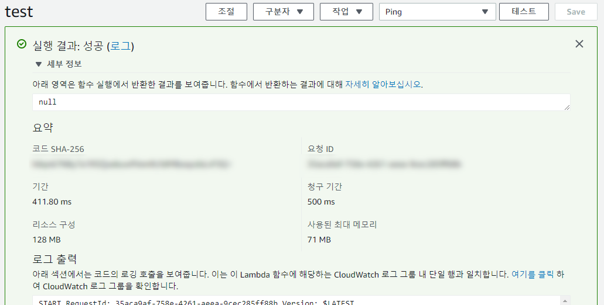

   <figcaption>콘솔 성공 로그</figcaption>

   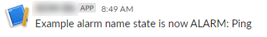

   <figcaption>Slack에 메시지가 도착했다!</figcaption>

## 8. (Optional) Slack message 꾸미기

뭐랄까.. 어째 메시지가 오긴 오는데 너무 지저분하다.

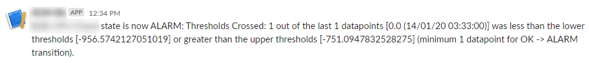

<figcaption>심지어 꼬부랑 글씨로만 써져있어..</figcaption>

1. [AWS CloudWatch 콘솔](https://ap-northeast-2.console.aws.amazon.com/cloudwatch/home)에서 경보 > 기록 항목 중 '작업 ... 이(가) 실행됨'이라고 되어있는 항목 상세를 클릭한다.

   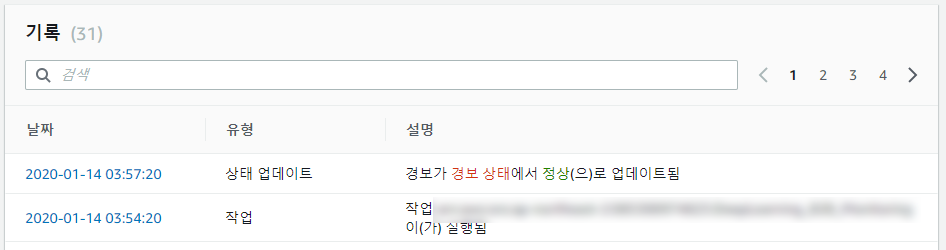

   <figcaption>날짜에 걸린 링크를 클릭하면 된다.</figcaption>

2. 기록 데이터 팝업이 뜨면 `publishedMessage` 항목을 볼 수 있는데, 해당 값이 실제 경보 실행 시 페이로드 값이다. 이 페이로드 값을 slack 규격에 맞게 파싱하면 된다.

   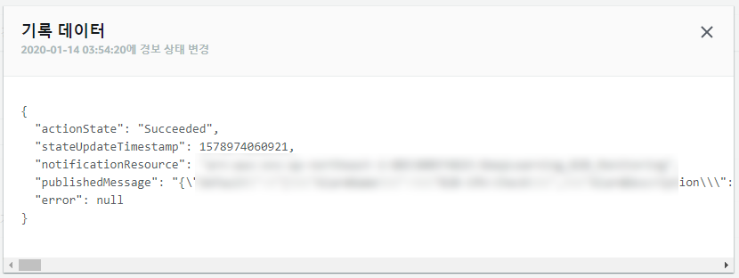

   <figcaption>사실 AWS가 뜬금포로 업데이트하지 않는 이상 테스트 이벤트 때 작성한 테스트 페이로드랑 거의 같다.</figcaption>

3. [Slack Block Kit Builder](https://api.slack.com/tools/block-kit-builde) 에서 쉽게 만들 수 있다.

   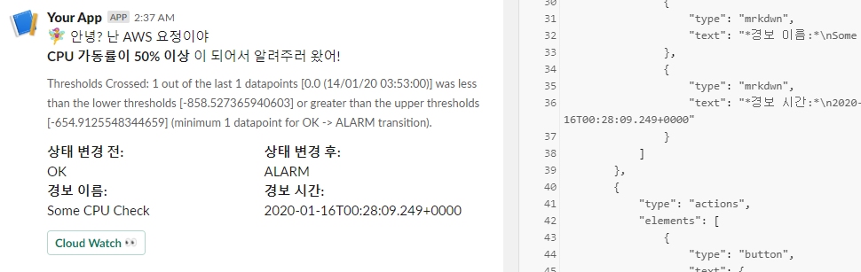

   <figcaption>`:emoji_name:`으로 emoji를 쓸 수도 있다.</figcaption>

4. Slack의 [Building attachments](https://api.slack.com/messaging/composing/layouts#attachments) 가이드를 참고해서 attachments 형태로 약간의 수정을 거친 후, aws lambda에 적용하면 된다.

   labmda 콘솔의 함수 코드 메뉴에서 `slack_message` 구문 작성을 수정한다. 나는 대충 이렇게 했다.

   ```python
    alarm_name = message['AlarmName']
    alarm_description = message['AlarmDescription']
    old_state = message['OldStateValue']
    new_state = message['NewStateValue']
    reason = message['NewStateReason']
    change_time = message['StateChangeTime']
    
    color = "#30db3f" if alarm_name.find("off") >= 0 else "#eb4034"
    
    slack_message = {
      "channel": SLACK_CHANNEL,
      "attachments": [{
        "color": color,
        "blocks": [
          {
            "type": "section",
            "fields": [
                {
                    "type": "mrkdwn",
                    "text": "*상태 변경 전:*\\n" + old_state
                },
                {
                    "type": "mrkdwn",
                    "text": "*상태 변경 후:*\\n" + new_state
                },
                {
                    "type": "mrkdwn",
                    "text": "*경보 이름:*\\n" + alarm_name
                },
                {
                    "type": "mrkdwn",
                    "text": "*경보 시간:*\\n" + change_time
                }
            ]
          },
          {
            "type": "actions",
            "elements": [
                {
                  "type": "button",
                  "text": {
                      "type": "plain_text",
                      "text": "Cloud Watch :eyes:"
                  },
                  "style": "primary",
                  "url": "<https://ap-northeast-2.console.aws.amazon.com/cloudwatch/home?region=ap-northeast-2#dashboards:name=CPU>"
                }
            ]
          }
        ]
      }],
      "blocks": [
        {
          "type": "section",
          "text": {
              "type": "mrkdwn",
              "text": ":female_fairy: 안녕? 난 AWS 요정이야\\n*" + alarm_description + "* 이 되어서 알려주러 왔어!"
          }
        },
        {
          "type": "divider"
        },
        {
          "type": "context",
          "elements": [
              {
                  "type": "mrkdwn",
                  "text": reason
              }
          ]
        }
      ]
    }
   ```

5. 그리고 CloudWatch 에서 기존에 설정한 경보가 울리면! Lambda 함수가 실행되면서 Slack 채널에 알림이 온다.

   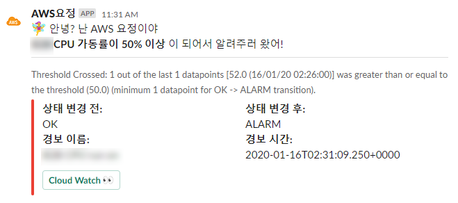

   <figcaption>AWS 요정 등장!</figcaption>
