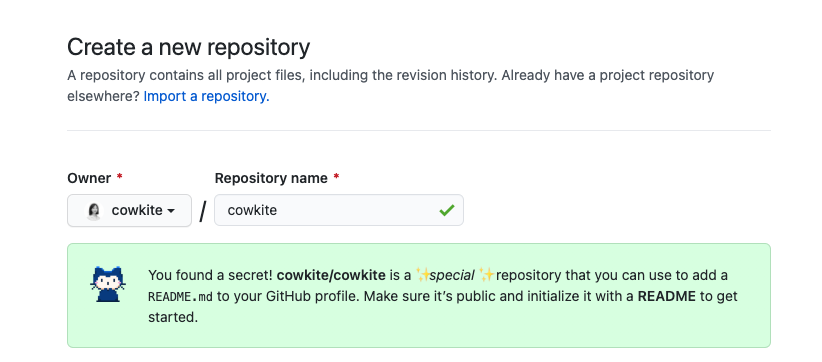

작년 여름 Github 신기능으로 프로필 영역을 꾸밀 수 있는 [Design Github profile using README.md](https://dev.to/web/design-github-profile-using-readme-md-8al) 포스팅이 공개되었다. 나도 한번 해봐야지하다가 바쁘다는 핑계로 미뤄왔는데, 최근 CV 정리하면서보니 더 이상 미루면 안 될 것 같아서 이제서야 해보았다. 😉


<figcaption>🌈💖✨휘황찬란하고 화려해진 제 프로필 좀 보세요❣️💕💛</figcaption>


# 프로필 생성하기

GitHub에는 여러 이스터에그가 있는데, *username.github.io* 이름의 repository를 생성하면 이 블로그처럼 [GitHub Pages](https://pages.github.com/)를 활용한 블로그를 생성할 수 있다. 프로필 또한 이 이스터에그 중 하나로 github user name과 동일한 이름의 repository를 만들면 *You found a secret!*이라는 메시지와 함께 `README.md` 파일로 깃헙 프로필을 작성할 수 있음으로 알려준다. 

Github 접속 > `Repository` > `New` 클릭하여 신규 repository를 생성해준 뒤 이름을 본인의 username과 동일하게 입력한다.



<figcaption>생성할 때 Add a README file 항목을 활성화해주면 직접 README.md 파일을 만들지 않아도 된다.</figcaption>


확인 버튼을 누르면 respotiroy가 만들어지고, `Add a README file` 옵션을 활성화했을 경우에는 `README.md` 파일이 함께 생성된다. (혹은 직접 만들어도 된다.)


<figcaption>기본으로 'Hi there 👋' 내용이 입력되어있다. </figcaption>

이 때 프로필로 가보면 위의 `README.md` 파일과 같은 내용으로 프로필 영역이 생긴것을 확인할 수 있다.


<figcaption>힘차게 흔드는 손 발견!</figcaption>

이제 이 `README.md` 파일을 마음껏 수정해서 프로필 영역을 작성하고 꾸미면 된다.


# 프로필 꾸미기(1) - 본문 작성

## [Shields.io](https://shields.io/) : 본문에 뱃지 넣기

나의 경우에는 연락처 정보와 스킬셋 기술을 위해 [Shields.io](https://shields.io/)를 사용해서 뱃지를 넣었다.


`https://img.shields.io/badge/<LABEL>-<MESSAGE>-<COLOR>` 형태로 파라미터를 잘 넣어주면 적당한 모양의 뱃지 이미지가 생성된다. 또한 `logo`, `logoColor`, `labelColor` 등의 여러 쿼리를 함께 사용할 수 있다.

  

예를들어 위처럼 안드로이드 로고와 'Android' 문구가 들어간 연두색의 뱃지를 생성하려면 아래 형식으로 가능하다.

```html

```

색상코드와 사용가능한 로고의 목록은 [simpleicons.org](https://simpleicons.org/)에서 확인할 수 있다.


# 프로필 꾸미기(2) - Pined repo 활용하기


프로필 메인의 repository 고정 영역을 gist를 활용한 여러 라이브러리를 통해 꾸밀 수 있다. 나는 2개의 라이브러리를 사용해서 꾸며봤는데, 커밋시각을 분석해서 아침형 개발자인지 저녁형 개발자인지 알려주는 `productive-box`와 깃헙 stats를 나타내는 `github-stats-box`를 사용했다.


## [productive-box](https://github.com/maxam2017/productive-box) : 커밋시각 통계 노출하기


<figcaption>나는 아침형 인간..!</figcaption>

### 사전 작업

1. [gist.github.com](https://gist.github.com/)에서 **public**으로 신규 gist를 생성한다. 제목과 내용은 향후 자동으로 업데이트 될 예정이므로 일단 아무렇게나 작성하면 된다.
2. [github 토큰생성](https://github.com/settings/tokens/new) 페이지에서 `gist`와 `repo` scope를 활성화하여 token을 발급한다. 이 때 발급된 토큰은 페이지를 빠져나가면 다시 얻을 수 없으니 클립보드 등에 잘 저장해둔다.

### 라이브러리 사용

1. [productive-box](https://github.com/maxam2017/productive-box) repository를 fork한다. 우측 상단의 `Fork` 버튼을 누르면 된다.
2. fork 된 나의 repository의 **Action** 탭에서 `enabled` 버튼을 눌러 Action을 활성화한다.
3. `.github/workflow/Schedule.yml` 파일을 수정하여 [환경변수](https://github.com/maxam2017/productive-box/blob/master/.github/workflows/schedule.yml#L17-L18)를 작성해준다
   * **GIST_ID**: *사전 작업의 1번 step*에서 생성된 gist의 id (gist URL은 `gist.github.com/{{username}}/{{gist-id}}`로 생성되기 때문에 주소창을 보면 된다.)
   * **TIMEZONE**: 타임존을 적어준다. `Asia/Seoul` 형식으로 적어주면 된다.
4. **Settings 탭 > Secrets**에 접속한 뒤 **New repository secret** 버튼을 클릭하여 환경변수를 설정해준다.
   * **GH_TOKEN**: *사전 작업의 2번 step*에서 발급받은 토큰

5. [gist를 내 프로필에 고정한다.](https://docs.github.com/en/github/setting-up-and-managing-your-github-profile/pinning-items-to-your-profile)
6. Action 주기(1시간)에 따라 자동으로 갱신 적용되나, 즉시 적용하고 싶다면 `README.md` 파일을 수정하는 등 파일에 변화를 주면 즉시 적용된다.


## [github-stats-box](https://github.com/bokub/github-stats-box) : Github Status 노출하기


### 사전 작업

1. [gist.github.com](https://gist.github.com/)에서 **public**으로 신규 gist를 생성한다. 제목과 내용은 향후 자동으로 업데이트 될 예정이므로 일단 아무렇게나 작성하면 된다.
2. [github 토큰생성](https://github.com/settings/tokens/new) 페이지에서 `gist`와 `repo` scope를 활성화하여 token을 발급한다. 이 때 발급된 토큰은 페이지를 빠져나가면 다시 얻을 수 없으니 클립보드 등에 잘 저장해둔다.

### 라이브러리 사용

1. [github-stats-box](https://github.com/bokub/github-stats-box) repository를 fork한다. 우측 상단의 `Fork` 버튼을 누르면 된다.
2. fork 된 나의 repository의 **Action** 탭에서 `enabled` 버튼을 눌러 Action을 활성화한다.
3. `.github/workflow/Schedule.yml` 파일을 수정하여 [환경변수](https://github.com/maxam2017/productive-box/blob/master/.github/workflows/schedule.yml#L17-L18)를 작성해준다
   * **GIST_ID**: *사전 작업의 1번 step*에서 생성된 gist의 id (gist URL은 `gist.github.com/{{username}}/{{gist-id}}`로 생성되기 때문에 주소창을 보면 된다.)
   * **ALL_COMMITS**: `true`일 경우 나의 전체 커밋을 카운트하고, `false`일 경우 작년 커밋만을 카운트한다.
   * **K_FORMAT**: `true`일 경우 `1.5k`와 같이 숫자를 "k"로 포맷팅하여 노출한다.
4. **Settings 탭 > Secrets**에 접속한 뒤 **New repository secret** 버튼을 클릭하여 환경변수를 설정해준다.
   * **GH_TOKEN**: *사전 작업의 2번 step*에서 발급받은 토큰

5. [gist를 내 프로필에 고정한다.](https://docs.github.com/en/github/setting-up-and-managing-your-github-profile/pinning-items-to-your-profile)
6. Action 주기에 따라 자동으로 갱신 적용되나, 즉시 적용하고 싶다면 `README.md` 파일을 수정하는 등 파일에 변화를 주면 즉시 적용된다.


# 그 외

## 더 많은 gists 라이브러리 찾아보기


[matchai/awesome-pinned-gists](https://github.com/matchai/awesome-pinned-gists)에 여러 라이브러리들이 정리되어있다. Twitter를 연동하여 내 최근 트윗을 보여주거나 Spotify를 연동하여 최근 재생 음악을 보여줄 수 있고, 그 외 내가 많이 사용하는 언어 등의 정보들도 노출할 수 있다.

## 백준 solved.ac 랭킹 노출하기


나는.. 백준을 잘 애용하진 않아서(핑계임) 브론즈따리라 차마 갖다 쓰진 않았지만, 다른 개발자들은 [mazassumnida/mazassumnida](https://github.com/mazassumnida/mazassumnida) 라이브러리를 활용해서 solved.ac 랭킹을 많이들 노출하는 것 같다. (라이브러리 이름이 '마자씀니다' 인가봄..)

## stats 등급 노출하기


나는 pinned gist를 활용해서 github stats를 노출했지만, [anuraghazra/github-readme-stats](https://github.com/anuraghazra/github-readme-stats) 라이브러리도 있다. 이걸 활용하면 여러가지 테마로 stats를 노출하고, 등급 정보까지 산정(?)할 수 있다. ~~최저 B 등급부터 시작하는 개발자의 센스가 돋보이는 라이브러리다.~~


# [🌱 제 깃헙도 놀러오세요..!](https://github.com/cowkite)

