재직중인 회사의 기술블로그에 [올리브영 안드로이드 테스트앱 자동배포하기](http://tech.oliveyoung.co.kr/tech/2107152128/)라는 제목으로 글을 기재했는데, 사족을 지우고 조금 더 깔끔하게 개인 블로그에도 남겨보고 싶어 글을 일부 수정해서 가져왔다. (회사 블로그에 글을 작성할 땐 왠지 모르게 괜한 사족을 붙여 둥글둥글한 느낌으로 작성하게 된다..)

참고로 부제는  
## 니들은.. 수동배포 같은거 하지마라.. 😎

<br/><br/>

그럼,, Start~!
<br/><br/>

## 📢 테스트앱 올라갔어요!
우리 회사에서 서비스하고 있는 '올리브영' 앱은 PlayStore Beta로 테스트앱 관리를 하고 있었다.
feature 단위 건의 개발이 완료되면 버전별로 테스트 앱을 배포하고 QC를 진행하는 방식인데,
가장 기본적인 방법일 수도 있지만 이게 여간 짜증나고 불편한 것이 아니다.

#### 1. 테스트앱을 제공하는데 너무 많은 시간이 걸린다.
개발이 완료되면 앱을 빌드한뒤 플레이스토어에 업로드해야한다.
우선 2차 인증을 거친 구글 로그인을 해야하고 적당한 릴리즈노트와 함께 앱을 업로드하면, 앱파일을 첨부하는데 일정 시간을 소요한뒤에 앱을 제출할 수 있다.
업로드가 완료되면 바로 제공되는 것도 아니고, 약 30분의 '출시준비중' 단계를 대기한 후에 테스터들에게 앱이 제공된다.

#### 2. 앱이 제공되고나면 QA엔지니어에게 직접 알려야한다.
앱이 제공되고나면 QA엔지니어에겐 누가 알려줄까? That's Me..^^.. 🧚‍♀️
앱 업로드 후 30분동안 '출시준비중' 상태를 뺑글뺑글 도는 것을 지켜보다가, 출시가 완료되면 QA엔지니어에게 호다닥 달려가서 알려준다. (호외요 호외~)

#### 3. 테스터가 추가될때마다 일일이 추가해야하고, 오랫동안 기다려야한다.
신규 테스터를 추가하기 위해서는, (1) 플레이스토어 계정을 전달받아야하고 (2) 전달받은 계정에 수기로 권한을 등록해야한다. (3) 권한을 획득한 테스터는 플레이스토어에서 '베타 참여하기' 버튼을 누른 뒤 (4) 약 4시간을 기다려야 테스트앱을 다운받을 수 있다.
이게 진짜 별거 아닌 것 같은데, 많이 들어올 땐 하루에도 몇번씩 이 문의가 들어온다. (바빠 죽겠는데 권한 추가하고 가이드 메일까지 보내줘야함. 환장할 노릇..)

#### 4. 이전 버전을 테스트할 수 없다. 한번에 1개의 버전만 테스트가 가능하다.
그나마 TestFlight는 '이전 빌드 보기'통해 과거 버전의 앱도 설치할 수 있어서, iOS는 이 방법으로 기능별 버전을 분리해서 QC를 진행하고 있는데, 플레이스토어는 가장 최신 버전의 앱만 제공할 수 있어 동시다발적으로 여러개의 QC를 태울땐 난감해진다.
또 프로덕트에 앱이 출시되고나면, 자연스레 Beta에 등록된 앱이 이전 버전이 되면서 무효화 되기 때문에 Beta앱을 또 다시 빌드해서 등록해주어야한다.
안 그래도 챙겨야할게 한두개가 아니라 바쁜 배포날.. 또 하나의 배포 태스크인셈..
매번 할때마다 너무 비효율적이라고 생각했다.


## 🤷 Bitrise가 아니라 fastlane을 선택한 이유
회사 블로그엔 글을 쓸때 이 부분을 엄청 구구절절하게 썼는데, 사실 원래는 무조건 Bitrise를 쓰고싶었다.. 허락도 받고 예산확보까지 받아놨는데... 내부망에서만 접근가능하도록 구성된 Git 환경 때문에 처참하게 적용 실패했다. 😔 너무 익숙해져서 내부망에서만 접근 가능하다는걸 깜박했던 것 같다.

🧚‍♀️: 마젤토브 힘내봐.. 마젤토브 빌드해봐..

🤖: (뭐래..)

~~근래 블로그에서 했던 드립중에 가장 맘에 드는 드립~~
#### Android도 iOS만큼 fastlane과 궁합이 괜찮을까?
굳이 이야기해보자면, 일단 다 떠나서 Firebase Distribution으로 테스트앱을 제공하자는 목표가 1차적으로 설정되어 있었고,
그 과정에서 [Firebase의 공식 document](https://firebase.google.com/docs/app-distribution/android/distribute-fastlane?hl=ko)에서도 fastlane 연동방법을 공식적으로 안내해주는것을 보고 괜찮겠군 싶었다.
어차피 iOS 앱에도 fastlane 적용중이었고.. 나중엔 젠킨스까지 연동해서 CI까지 쉽게 적용할 수 있을 것 같아서 마음에 들었다.

# 🎬 본격적인 적용기!
## 🏃‍ 이제 적용해보자!
자 이제 플랫폼 검토가 끝났으니 적용을 해야한다.
Firebase 공식문서인 [Distribute Android apps to testers using fastlane](https://firebase.google.com/docs/app-distribution/android/distribute-fastlane)을 참고해서 쉽게 적용할 수 있었다.

### 1. Google 자격증명 획득
서비스 연동을 위해 API키를 생성하고 Google PlayStore에 등록해줘야한다.
스크린샷을 첨부했으나, 회사 보안 지침상 문제가 될만한 내용들은 모두 가렸고 그나마 노출되는 정보는 스크린샷을 촬영하기위한 테스팅 정보들이다. (열심히 가리느라 힘들었다 💦) 

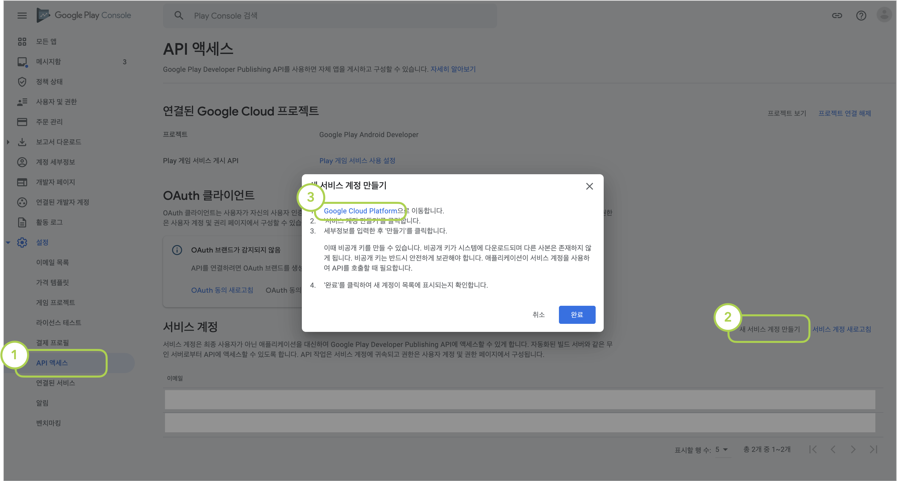
<figcaption>1. Google Play Console > 설정 > API 액세스 > 새 서비스 계정 만들기 > Google Cloud Platform 링크 클릭</figcaption>

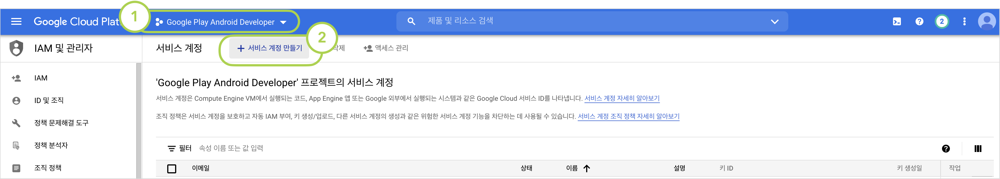
<figcaption>2. 'Google Play Android Developer' 프로젝트 선택 > 서비스 계정 만들기 클릭</figcaption>

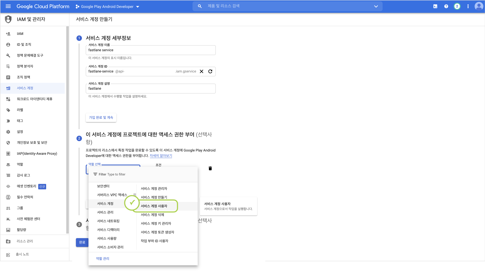
<figcaption>3. 서비스 계정 정보 입력. 이 때 역할을 필수로 '서비스 계정 사용자'로 설정해주어야 한다.</figcaption>

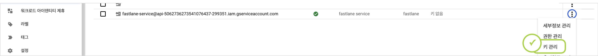
<figcaption>4. 서비스 계정이 생성되었으면, '키 관리' 메뉴로 이동</figcaption>

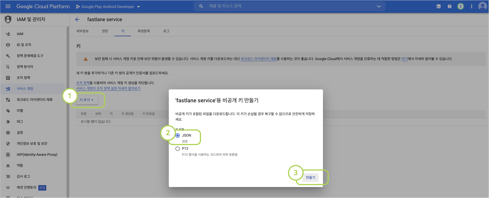
<figcaption>5. 키 추가 > 새 키 만들기 > JSON > 만들기 클릭 후 생성된 키를 기기에 저장</figcaption>

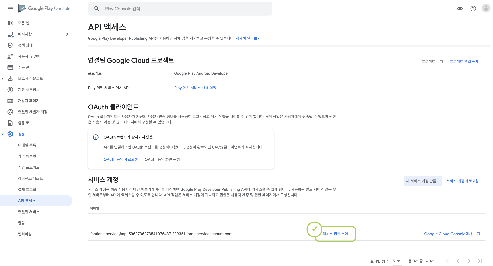
<figcaption>6. 다시 1번의 Google Play Console로 돌아오면 신규 서비스계정이 생성된것을 확인할 수 있다. 여기서 '액세스 권한 부여' 버튼을 클릭</figcaption>

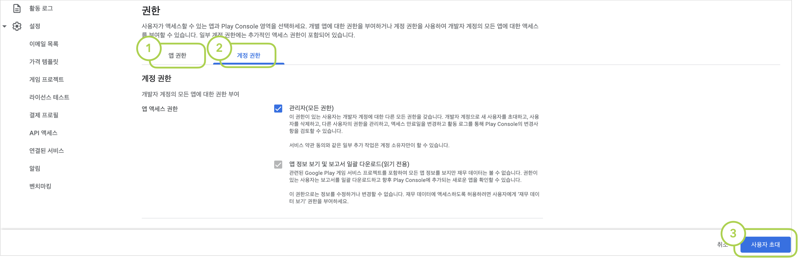
<figcaption>7. '앱 권한' 메뉴에서 타겟 앱을 설정하고, '계정 권한' 메뉴에서 '관리자 권한'을 부여한 후 '사용자 초대' 버튼을 클릭하여 완료</figcaption>

### 2. Firebase App Distribution 활성화

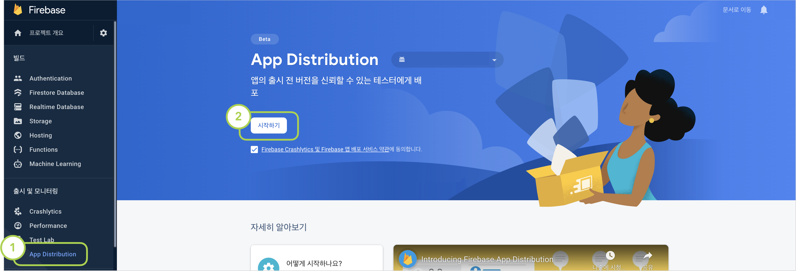
<figcaption>Firebase console에서 App Distribution 메뉴에 진입하여 기능을 활성화해준다.</figcaption>

### 3. fastlane 설치

macOS 기준으로 fastlane 설치하는 방법을 설명한다.
터미널에서 하기 명령어를 실행하여 fastlane을 설치한다.

```shell
$ brew install fastlane
```

프로젝트 경로로 이동하여, fastlane을 초기화해준다. 해당 과정에서 패키지명과 위 [사전작업](#사전작업) 단계에서 설정한 JSON 파일 경로를 입력하게 된다.

```shell
~/workspace$ fastlane init
```

(옵션) fastlane이 정상 설치 되었는지 확인하려면 아래 명령어를 입력해준다.

```shell
~/workspace$ bundle exec fastlane test
```


### 4. fastlane과 Firebase App Distribution 연결

fastlane을 Firebase App Distribution과 연결해준다.

```shell
~/workspace$ fastlane add_plugin firebase_app_distribution
```

하기 명령어를 입력하여 인증을 위한 Google Auth URL을 받아온다.

```shell
~/workspace$ bundle exec fastlane run firebase_app_distribution_login
> Open the following address in your browser and sign in with your Google account:
> https://accounts.google.com/o/oauth2/auth....
```

터미널에서 출력된 페이지 URL을 브라우저로 실행하여 인증한 뒤, 반환되는 인증코드를 콘솔에 입력하면 Refresh Token이 발급된다. 해당 토큰을 환경변수로 설정해준다.
```shell
$ export FIREBASE_TOKEN={token}
```

### 5. 배포 lane 설정
마지막으로 배포를 위한 lane 명령어를 생성한다.
workspace의 `./fastlane/Fastfile` 파일을 열어 하기 블록을 추가해준다.
```
...
  desc "Lane for distribution"
  lane :distribute do
      gradle(
          task: "assembleDevelop",
          build_type: "Release"
      )

      firebase_app_distribution(
          app: "(Firbase App ID)",
          groups_file: "fastlane/testers-groups.txt",
          release_notes_file: "fastlane/release-notes.txt",
          debug: true
      )
  end
```
각 설정값 별 상세 옵션은 [Firebase App Distribution - 3단계: Fastfile 설정 및 앱 배포](https://firebase.google.com/docs/app-distribution/android/distribute-fastlane#step_3_set_up_your_fastfile_and_distribute_your_app) 문서에서 확인하실 수 있다.
우리 앱은 앱개발담당자/QA/기획자/협력사 정도로 구분해서 각 테스터들 그룹을 만들고, 해당 그룹의 정보가 위치한 txt 파일을 바라보도록 설정했다.
릴리즈노트도 이런식으로 작성하면 관리에 더 용이하다.

# 🚀 배포 시작
## 실행
이제 번거로운 빌드-업로드-배포-확인요청 4단계를, 단 한줄만으로 완료할 수 있다!
```shell
$ fastlane distribution

# 만약 gradle permission dined 오류가 발생한다면 하기 명령어로 권한 부여 후 재시도 해준다.
~/workspace$ chmod +x gradlew 
```

## 👾 테스터 추가
이제 마지막으로 테스터들을 추가해야한다!
일일이 메일계정을 취합받아서 등록하는 방법과 URL을 통해 직접 참여할 수 있도록 유도하는 방법이 있는데, 당연히 후자로 ㄱㄱ

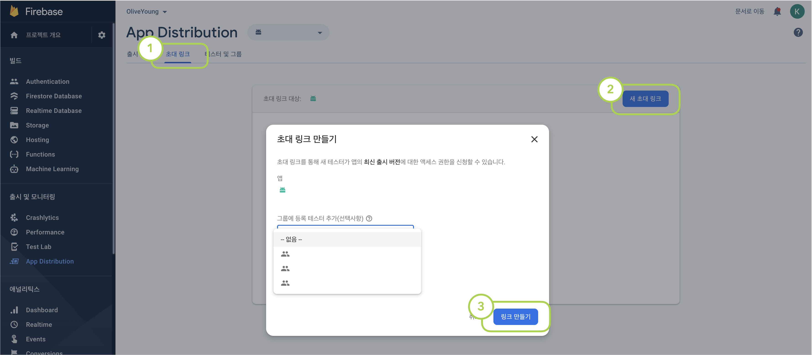
<figcaption>Firebase console에서 초대 링크 > 새 초대 링크 > 그룹 선택 > 링크 만들기 클릭</figcaption>

### 💁 QA 엔지니어 초대
위에서 만든 링크를 이제 QA 엔지니어들에게 전달하기만하면 된다.
QA 엔지니어는 링크를 통해 테스트앱을 설치할 수 있다.
이때, 'App Tester'라는 앱을 설치하면 향후에도 계속 편하게 테스트앱을 받아볼 수 있다.
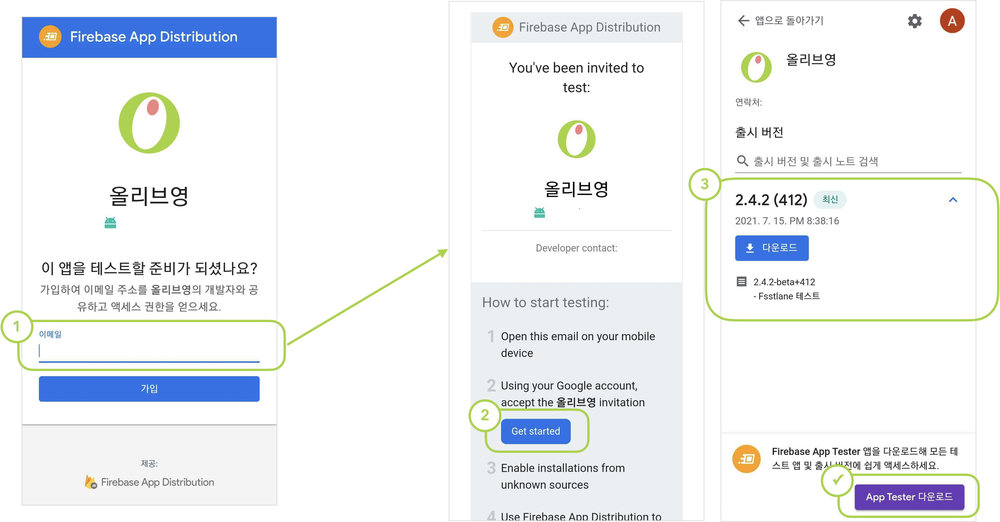
<figcaption>테스터들은 링크를 클릭한 후 이메일 주소를 입력하면, 메일에서 Firebase의 친절한 안내를 따라 앱을 설치할 수 있다.</figcaption>


## 마치며

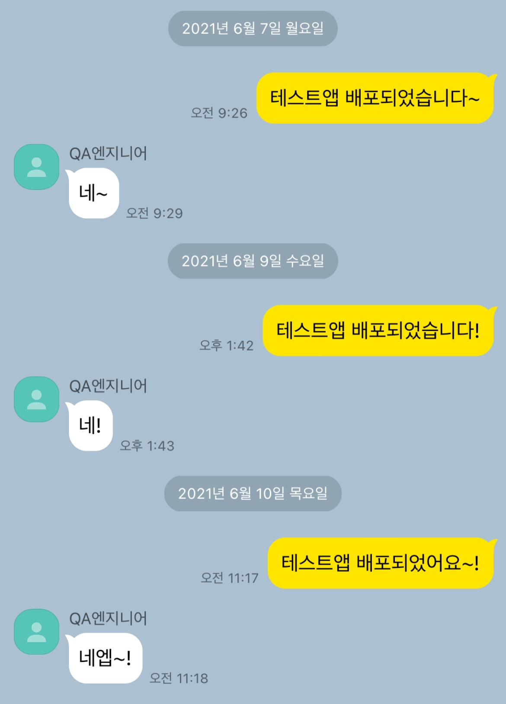
<figcaption>회사블로그에 글 실으려고 처음으로 만들어본 주작 톡..</figcaption>

거창하게 자동배포 어쩌고 하긴했는데, 사실 약 반년간 이 프로젝트하면서 비효율적인 부분이 너무 많고 날이 갈면 갈 수록 점점 바빠져서 충분히 개선 될 수 있을 부분들에 더 이상 힘 쏟고 싶지 않았다. 🤢 Firebase App Distribution 적용하는 것도 벼르고 벼르던 일 중에 하나였는데 드디어 해내서 정말 기분 좋다ㅠㅠ! 이제 하루 30분 정도 아꼈으니 일주일동안 약 2시간 정도는 개발 더 할 수 있다.. 🥳 (기뻐야하는데 왜 눈물이 나지..)
